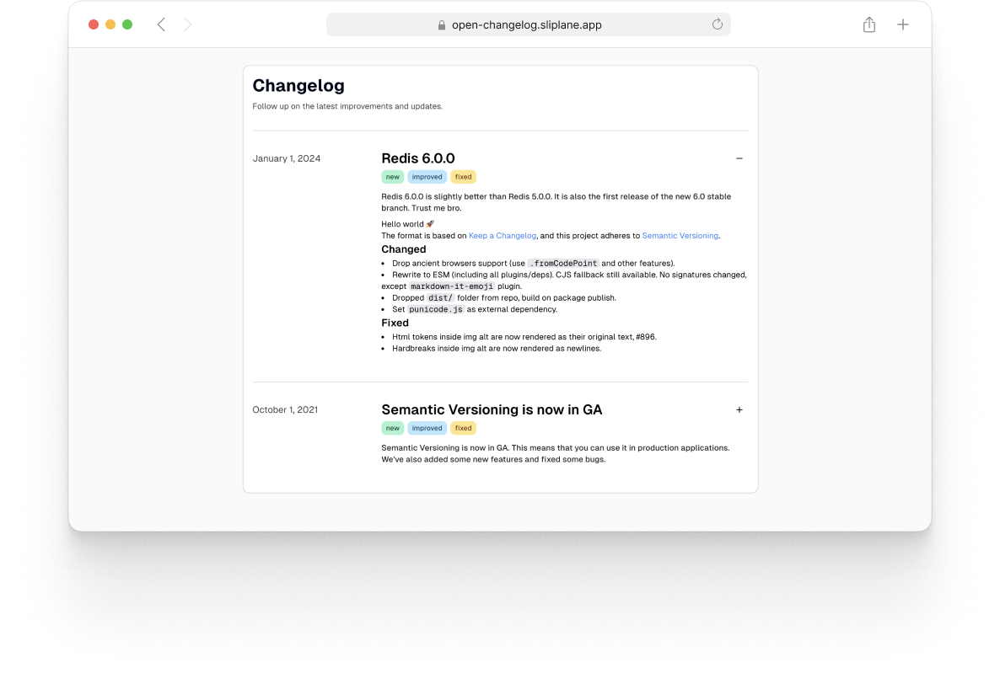
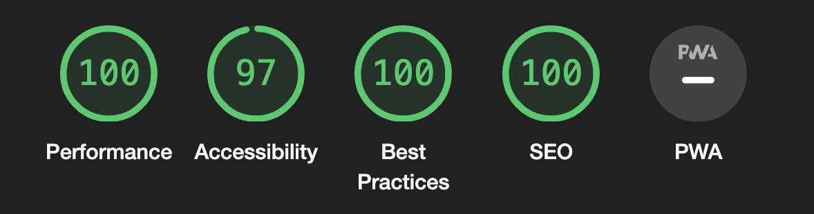

# Open Changelog 🪸

OpenChangelog is a simple open-source changelog webapp based on Next.js and MDX.

It is designed to be easy to use and deploy, minimalistic, and uses Markdown files stored on Github as the CMS.



If you care about that sort of thing, Google Lighthouse also thinks it's cool:



## Built with 🚀

- [Next.js](https://nextjs.org/)
- [Tailwind CSS](https://tailwindcss.com/)
- [shadcn/ui](https://ui.shadcn.com/)

## Roadmap

- [ ] RSS Feeds
- [ ] Email notifications
- [ ] I18N
- [ ] Branding

## Getting Started 🏁

### Requirements

- [Node.js](https://nodejs.org/en/) >= 20
- [pnpm](https://pnpm.io/) >= 8

Other versions might work, but they are not tested and not officially supported.

### Develop

To run the app locally, you need to have [pnpm](https://pnpm.io/) installed. You can then install the dependencies and run the app with:

```sh
pnpm install
pnpm dev --filter changelog
```

### Adding Changelogs

Changelogs are stored in the `apps/changelog/data` directory. You can add a new changelog by creating a new file in this directory with the filename being in the format of `yyyy-mm-dd.mdx`. The file should contain the following frontmatter:

```
---
title: some cool title
tags: [new, improved, fixed]
summary: a one or two sentence summary for your lazy readers
---

Actual content goes here
```

### Deploy

OpenChangelog is provider-agnostic, you can deploy it with pretty much any provider that supports Next.js or Docker. If you want to deploy it with Docker, you can build the image with:

```sh
docker build -t changelog -f apps/changelog/Dockerfile .
```

This will build the image (~160MB) with the production build of the app. You can then run it with:

```sh
docker run -p 3000:3000 changelog
```

The [demo](https://open-changelog.sliplane.app) is deployed with [Sliplane](https://sliplane.io/).

## License

Open Changelog is licensed under the [AGPL-3.0 license](./LICENSE)
